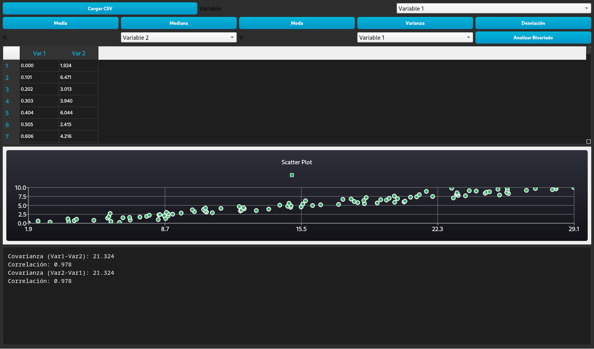

# Analizador Estadístico

Este es un proyecto de escritorio desarrollado en C++ con el framework Qt 6. La aplicación permite realizar análisis estadísticos básicos, tanto univariados como bivariados, a partir de datos cargados desde un archivo CSV.

## Características

- **Carga de Datos**: Carga de datos desde archivos CSV.
- **Análisis Univariado**:
  - Media
  - Mediana
  - Moda
  - Varianza
  - Desviación Estándar
- **Análisis Bivariado**:
  - Covarianza
  - Correlación de Pearson
- **Visualización de Datos**:
  - Histogramas para el análisis univariado.
  - Gráficos de dispersión para el análisis bivariado.

## Capturas de Pantalla



## Dependencias

- **Qt6**:
  - Core
  - Widgets
  - Charts
  - Concurrent
- **CMake** (versión 3.16 o superior)
- **Compilador de C++** (compatible con C++17)

## Instalación y Compilación

1. **Clona el repositorio**:
   ```bash
   git clone <https://github.com/Abraham-Orta/estadistica.git>
   cd <estadistica>
   ```

2. **Crea un directorio de compilación**:
   ```bash
   mkdir build
   cd build
   ```

3. **Ejecuta CMake y compila el proyecto**:
   ```bash
   cmake ..
   cmake --build .
   ```

## Uso

Una vez compilado, puedes ejecutar la aplicación desde el directorio `build`:

```bash
./Estadisticas
```

La aplicación se iniciará y podrás cargar un archivo CSV para comenzar el análisis.

## Contribuciones

Las contribuciones son bienvenidas. Si deseas contribuir, por favor, abre un "issue" para discutir los cambios propuestos o envía un "pull request".
